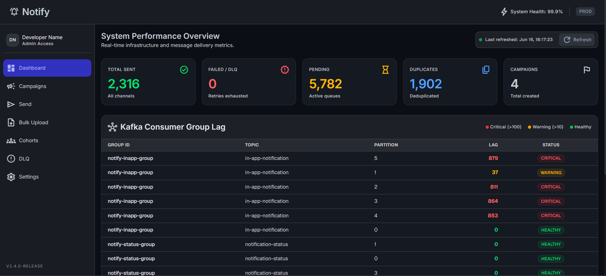
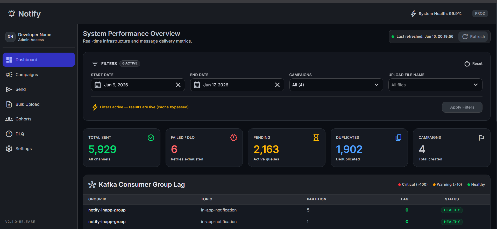
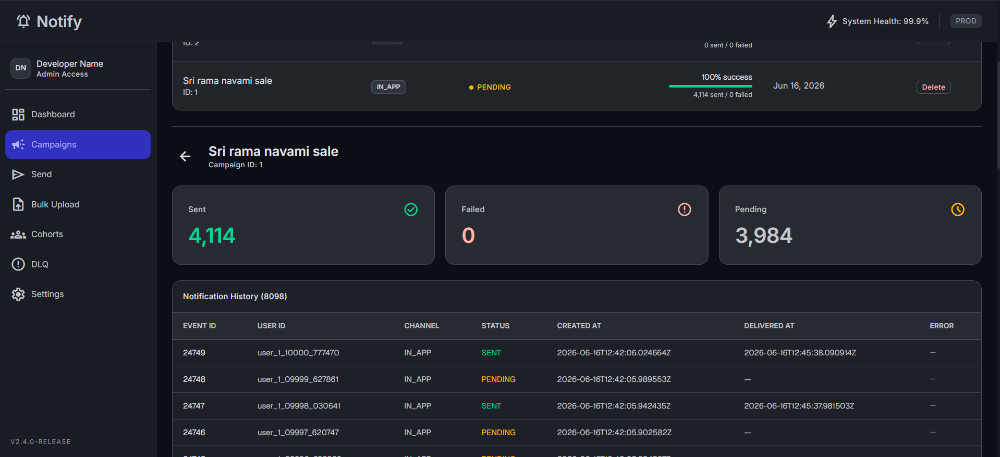

<div align="center">

# 🔔 Notify

### A Production-Grade Notification Delivery Engine


</div>

---

## What is Notify?

Notify is a production-grade notification delivery engine that sits **between your application and downstream delivery channels** — email, SMS, and in-app. It acts as a reliability and orchestration layer, ensuring every notification gets delivered, tracked, and audited — even when things go wrong.

Think of it like what [Novu](https://novu.co), [Knock](https://knock.app), or [Courier](https://courier.com) do as a product — built from scratch, with full control over the pipeline.

> **Notify does NOT replace Twilio or an email provider.** It is the layer that sits in front of them — handling retries, deduplication, routing, bulk campaigns, and delivery observability. Swapping in a real provider is a one-line change in the handler.

---

## Where does Notify fit in your stack?

```
  Your Application / Backend
         |
         |  POST /api/v1/notify  (HMAC-signed API key)
         ↓
  ┌─────────────────────────────────────────────────┐
  │                    Notify                       │
  │   • Deduplication  (Redis Cuckoo Filter)        │
  │   • Kafka fan-out to channel topics             │
  │   • Retry + Dead Letter Queue pipeline          │
  │   • Full status tracking in PostgreSQL          │
  └─────────────────────────────────────────────────┘
         |              |               |
         ↓              ↓               ↓
      Email           SMS           In-App
   (Twilio /       (Twilio /     (PostgreSQL
   SendGrid)        MSG91)        persisted)
```

---

## Why Notify? — Problems it solves

| Problem | How Notify solves it |
|---|---|
| Silent delivery failures | DLQ + exponential backoff — nothing is dropped without a trace |
| Duplicate notifications | Redis Cuckoo Filter — O(1) idempotency check before any processing |
| Dirty bulk CSV data | Dedup pipeline — shows total / unique / duplicate counts per upload |
| Burst traffic crashing providers | Kafka buffering — API returns `202` instantly, consumers process async |
| No delivery observability | Full status tracking + Kafka consumer lag dashboard in real-time |
| No recipient management | Cuckoo Filter supports deletion — remove recipients post-upload |

### Silent failures — notifications dropped without trace
Without a retry layer, a transient provider outage silently drops notifications. Notify implements exponential backoff retry with a Dead Letter Queue (DLQ). Every failure is visible, tracked, and retryable from the dashboard.

### Duplicate notifications — same message sent twice
Race conditions, double-clicks, retried HTTP calls — all cause duplicate sends. Notify uses a Redis Cuckoo Filter to check idempotency keys before processing. Same key = rejected at the gate, before any Kafka event is produced.

### Bulk CSV uploads with dirty data
Real user lists have duplicates. Notify's bulk upload pipeline deduplicates the entire file using the Cuckoo Filter before enqueueing, shows exactly how many duplicates were removed, and lets you delete specific recipients after the fact.

### Burst traffic overwhelming providers
A sudden spike of 10,000 notifications will crash a synchronous delivery system. Kafka decouples the API from consumers — the REST endpoint returns `202 Accepted` immediately while consumers process at their own rate.

---

## Screenshots

<!-- 📸 Place screenshot: docs/screenshots/dashboard.png -->
<!-- This is the main dashboard screenshot (Image 2) — System Performance Overview showing the 5 stat cards (Total Sent: 2,316 | Failed/DLQ: 0 | Pending: 5,782 | Duplicates: 1,902 | Campaigns: 4) and the Kafka Consumer Group Lag table -->

*System Performance Overview — real-time stats and Kafka Consumer Group Lag per partition*

---

<!-- 📸 Place screenshot: docs/screenshots/dashboard-filters.png -->
<!-- This is the dashboard with filters open (Image 3) — showing Start Date / End Date / Campaigns / Upload File Name filters active, "6 ACTIVE" badge, and the "Filters active — results are live (cache bypassed)" warning banner -->

*Dashboard with active filters — cache bypassed for live results*

---

<!-- 📸 Place screenshot: docs/screenshots/campaign-detail.png -->
<!-- This is the campaign detail view (Image 1) — "Sri rama navami sale" campaign, showing Sent: 4,114 | Failed: 0 | Pending: 3,984 cards, and the Notification History table with EVENT ID, USER ID, CHANNEL, STATUS (SENT/PENDING), CREATED AT, DELIVERED AT columns -->

*Campaign Detail — per-notification history with delivery timestamps and status*

---

## Infrastructure

### Apache Kafka — Async Fan-out & Retry Pipeline

Kafka is the backbone of the delivery pipeline. When a notification request arrives, the API produces an event to a Kafka topic and returns `202` immediately. Independent consumer threads handle actual delivery at their own pace, with automatic retries.

| Topic | Purpose |
|---|---|
| `notification-requested` | Entry point — router distributes to channel topics |
| `email-notification` | Email channel consumer input |
| `sms-notification` | SMS channel consumer input |
| `in-app-notification` | In-app channel consumer input |
| `retry-notification` | Exponential backoff retry queue |
| `dead-letter-notification` | Final DLQ — unrecoverable failures land here |
| `notification-status` | Delivery status events written back to the API layer |

> Consumer Group Lag is a first-class metric on the dashboard. Per-partition lag is colour-coded — **green** (Healthy), **amber** (Warning >10), **red** (Critical >100).

---

### Redis Cuckoo Filter — Deduplication

Notify uses Redis Stack's Cuckoo Filter (`CF.*` commands) for idempotency checks and bulk-upload deduplication. A Cuckoo Filter was chosen over a standard Bloom Filter for one critical reason: **deletion support**.

| Property | Cuckoo Filter ✓ | Bloom Filter ✗ |
|---|---|---|
| False positive rate | ~1-3% configurable | ~1-3% configurable |
| **Deletion support** | **YES — `CF.DEL` command** | **NO — cannot delete entries** |
| Lookup speed | O(1) | O(k) hash functions |
| Space efficiency | ~1.05x overhead | ~1.44x overhead |
| Why Notify uses it | Recipients can be removed from cohorts via the frontend | Would require full filter rebuild to remove one recipient |

Every cohort gets its own Cuckoo Filter. The filter state is persisted to PostgreSQL as a `BYTEA` snapshot so it survives restarts.

---

### Java 21 + Spring Boot 4 — Backend

A single Spring Boot monolith — intentionally not microservices. One JAR handles all API, Kafka producers/consumers, and business logic. Keeps RAM usage sane locally while demonstrating real production patterns.

- **Spring Kafka** — `@KafkaListener` per channel with consumer group offset tracking
- **Spring Data JPA + Hibernate 6** — JSONB payload support, `@DynamicUpdate` for partial updates
- **Flyway** — versioned SQL migrations, auto-applied on startup
- **Micrometer** — custom metrics exposed for dashboard aggregations
- **Testcontainers** — integration tests spin up real Postgres + Kafka via Docker

---

### React + Vite — Frontend

Dark-themed dashboard connecting to the backend via HMAC-SHA256 signed API keys. Every request includes a timestamp to prevent replay attacks.

- **TanStack Router v1** — type-safe file-based routing
- **TanStack Query v5** — server state with auto-refetch for live dashboard metrics
- **shadcn/ui + TailwindCSS** — accessible components, fully responsive
- **Papa Parse** — client-side CSV preview before upload
- **Recharts** — throughput and delivery rate visualisations

---

### PostgreSQL 16 — Persistence

| Table | Purpose |
|---|---|
| `notifications` | Every event with full status history and retry count |
| `notification_cohorts` | Bulk upload batches with dedup statistics |
| `cohort_recipients` | Per-recipient dedup result within a cohort |
| `dead_letter_events` | Permanently failed notifications |
| `api_keys` | UUID keys with optional IP-CIDR binding and HMAC secrets |

---

## Implementation

Full source code is split into two directories, each with its own detailed README.

| Directory | Stack |
|---|---|
| [`notify-backend/`](./notify-backend) | Java 21 · Spring Boot 3 · Kafka · Hibernate · Flyway · Testcontainers |
| [`notify-frontend/`](./notify-frontend) | React 18 · Vite · TailwindCSS · shadcn/ui · TanStack Router + Query |

---

## Running the Project

The entire infrastructure — Kafka, Zookeeper, Redis Stack, PostgreSQL, Kafka UI, pgAdmin — is managed via Docker Compose through a root `Makefile`. You only need Docker and Java 21 installed locally.

### Prerequisites

| Tool | Version |
|---|---|
| Java | 21 |
| Docker | 24+ |
| Docker Compose | v2 |
| Node.js | 18+ (frontend only) |

### Quickstart

```bash
# 1. Clone
git clone https://github.com/your-username/notify.git
cd notify

# 2. Start all infrastructure
make up

# 3. Run backend (new terminal)
cd notify-backend && ./gradlew bootRun

# 4. Run frontend (new terminal)
cd notify-frontend && npm install && npm run dev
```

### Make commands

| Command | What it does |
|---|---|
| `make up` | Start all Docker services (Kafka + Redis + Postgres + UI tools) |
| `make dev` | Start Kafka + Redis only (assumes local Postgres) |
| `make down` | Stop containers, keep volumes |
| `make down-v` | Full reset — stop all + wipe all volumes |
| `make logs` | Tail logs from all running containers |
| `make ps` | Show status of all services |
| `make verify-redis` | Smoke-test Cuckoo Filter commands (`CF.ADD` / `CF.EXISTS` / `CF.DEL`) |

### Service URLs

| Service | URL | Notes |
|---|---|---|
| Backend API | http://localhost:8080 | Swagger at `/swagger-ui.html` |
| Frontend | http://localhost:5173 | React dev server |
| Kafka UI | http://localhost:8082 | Browse topics, consumer groups, lag |
| pgAdmin | http://localhost:5050 | PostgreSQL browser |
| PostgreSQL | `localhost:5432` | DB: `notify` / user: `postgres` |
| Redis Stack | `localhost:6379` | Cuckoo Filter commands available |

---

<div align="center">

**v2.4.0-RELEASE** · Built with Java 21, Spring Boot, Kafka, Redis Stack, React

</div>